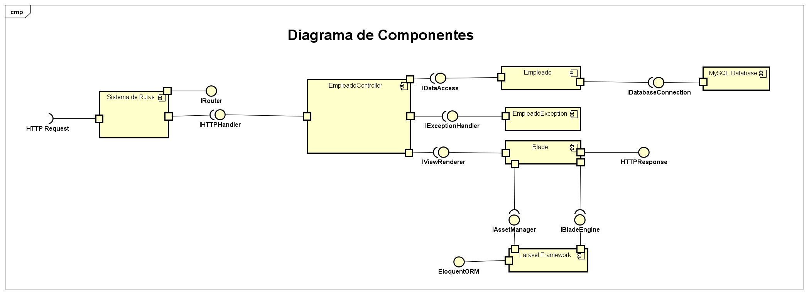
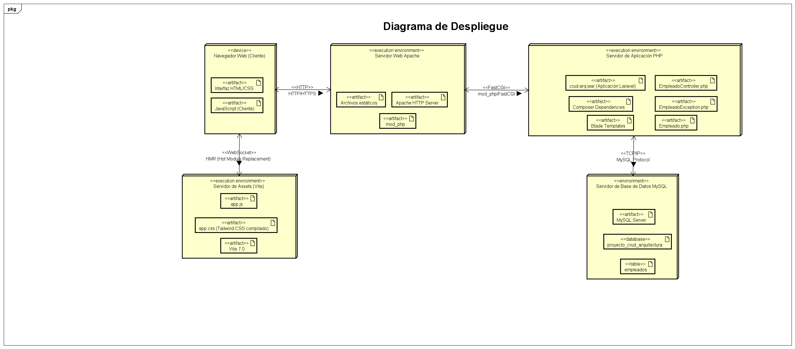

El sistema está construido siguiendo la arquitectura MVC (Model-View-Controller) de Laravel, con componentes claramente definidos que interactúan mediante interfaces bien establecidas.

### 2.1 Componente: EmpleadoController

**Nombre:** EmpleadoController.

**Descripción:** 
Componente controlador principal del sistema que gestiona todas las operaciones relacionadas con empleados. Actúa como intermediario entre la capa de presentación (vistas) y la capa de datos (modelo), procesando las solicitudes HTTP, ejecutando la lógica de negocio, y devolviendo las respuestas apropiadas.

**Dependencias con otros componentes:**
- **Empleado (Modelo):** Utiliza el modelo Empleado para realizar operaciones de base de datos (CRUD)
- **EmpleadoException:** Consume la clase de excepciones personalizadas para el manejo de errores
- **Request (Laravel):** Depende del objeto Request de Laravel para procesar datos de formularios y parámetros.
- **QueryException (Laravel):** Utiliza las excepciones de base de datos de Laravel para capturar errores SQL.
- **Sistema de vistas (Blade):** Renderiza vistas Blade para presentar información al usuario.

**Interfaces de salida (Servicios que Provee):**

1. **index(Request $request): View**
   - Descripción: Servicio de listado y búsqueda de empleados con paginación.
   - Entrada: Parámetros de búsqueda opcionales.
   - Salida: Vista HTML con listado de empleados.

2. **create(): View**
   - Descripción: Servicio que proporciona el formulario de creación.
   - Entrada: Ninguna.
   - Salida: Vista HTML con formulario vacío.

3. **store(Request $request): RedirectResponse**
   - Descripción: Servicio de creación de nuevo empleado.
   - Entrada: Datos del formulario validados.
   - Salida: Redirección con mensaje de éxito o error.

4. **show(Empleado $empleado): View**
   - Descripción: Servicio de visualización de detalles de un empleado.
   - Entrada: ID del empleado (route binding).
   - Salida: Vista HTML con información detallada.

5. **edit(Empleado $empleado): View**
   - Descripción: Servicio que proporciona el formulario de edición pre-llenado.
   - Entrada: ID del empleado (route binding).
   - Salida: Vista HTML con formulario pre-llenado.

6. **update(Request $request, Empleado $empleado): RedirectResponse**
   - Descripción: Servicio de actualización de empleado existente.
   - Entrada: Datos actualizados del formulario.
   - Salida: Redirección con mensaje de éxito o error.

7. **destroy(Empleado $empleado): RedirectResponse**
   - Descripción: Servicio de eliminación de un empleado.
   - Entrada: ID del empleado (route binding).
   - Salida: Redirección con mensaje de éxito o error.

8. **destroyMultiple(Request $request): RedirectResponse**
   - Descripción: Servicio de eliminación múltiple de empleados.
   - Entrada: Array de IDs de empleados.
   - Salida: Redirección con mensaje de éxito o error.

**Interfaces de entrada (Servicios que consume):**

1. **Request->validate()**
   - Descripción: Consume el servicio de validación de Laravel para validar datos de entrada.
   - Proveedor: Illuminate\Http\Request

2. **Empleado::query()**
   - Descripción: Consume el constructor de consultas del modelo Empleado.
   - Proveedor: App\Models\Empleado

3. **Empleado::create()**
   - Descripción: Consume el servicio de creación de registros del modelo.
   - Proveedor: App\Models\Empleado

4. **Empleado->update()**
   - Descripción: Consume el servicio de actualización de registros.
   - Proveedor: App\Models\Empleado

5. **Empleado->delete()**
   - Descripción: Consume el servicio de eliminación de registros.
   - Proveedor: App\Models\Empleado

6. **view()**
   - Descripción: Consume el servicio de renderizado de vistas Blade.
   - Proveedor: Laravel View System.

7. **redirect()->route()**
   - Descripción: Consume el servicio de redirección de Laravel.
   - Proveedor: Laravel Routing System.

**Artefactos:**
- **Archivo:** `app/Http/Controllers/EmpleadoController.php`
- **Dependencias de Laravel:**
  - `Illuminate\Http\Request`
  - `Illuminate\Http\RedirectResponse`
  - `Illuminate\View\View`
  - `Illuminate\Database\QueryException`
- **Vistas Blade:**
  - `resources/views/empleados/index.blade.php`
  - `resources/views/empleados/create.blade.php`
  - `resources/views/empleados/edit.blade.php`
  - `resources/views/empleados/show.blade.php`
- **Rutas:** `routes/web.php`

---

### 2.2 Componente: Empleado (Modelo)

**Nombre:** Empleado.

**Descripción:**
Componente de modelo que representa la entidad Empleado en el sistema. Implementa el patrón Active Record mediante Eloquent ORM, proporcionando una interfaz orientada a objetos para interactuar con la tabla `empleados` en la base de datos. Encapsula la lógica de acceso a datos y define la estructura y comportamiento de los empleados.

**Dependencias con otros componentes:**
- **Eloquent Model:** Extiende de la clase Model de Laravel para heredar funcionalidades ORM.
- **HasFactory Trait:** Utiliza el trait HasFactory para generación de datos de prueba.
- **Base de Datos MySQL:** Depende del motor de base de datos para persistencia.
- **Schema Builder:** Utiliza las migraciones de Laravel para definición de estructura.

**Interfaces de salida (servicios que provee):**

1. **query(): Builder**
   - Descripción: Proporciona un constructor de consultas para operaciones complejas.
   - Entrada: Ninguna.
   - Salida: Instancia de Query Builder.

2. **create(array $attributes): Empleado**
   - Descripción: Servicio de creación de nuevo registro.
   - Entrada: Array asociativo con atributos del empleado.
   - Salida: Instancia del empleado creado.

3. **update(array $attributes): bool**
   - Descripción: Servicio de actualización de registro existente.
   - Entrada: Array asociativo con atributos a actualizar.
   - Salida: Booleano indicando éxito de la operación.

4. **delete(): bool**
   - Descripción: Servicio de eliminación de registro.
   - Entrada: Ninguna (operación sobre la instancia).
   - Salida: Booleano indicando éxito de la operación.

5. **find(int $id): ?Empleado**
   - Descripción: Servicio de búsqueda por ID.
   - Entrada: ID del empleado.
   - Salida: Instancia del empleado o null.

6. **where(string $column, mixed $value): Builder**
   - Descripción: Servicio de filtrado por columna.
   - Entrada: Nombre de columna y valor.
   - Salida: Query Builder con filtro aplicado.

7. **paginate(int $perPage): LengthAwarePaginator**
   - Descripción: Servicio de paginación de resultados.
   - Entrada: Cantidad de registros por página.
   - Salida: Objeto paginador con resultados.

**Interfaces de entrada (Servicios que consume):**

1. **Database Connection**
   - Descripción: Consume servicios de conexión a base de datos MySQL.
   - Proveedor: Laravel Database Manager.

2. **Query Builder**
   - Descripción: Consume el constructor de consultas SQL de Eloquent.
   - Proveedor: Illuminate\Database\Query\Builder

3. **Schema Builder**
   - Descripción: Consume servicios de definición de esquema.
   - Proveedor: Illuminate\Database\Schema\Builder

**Artefactos:**
- **Archivo:** `app/Models/Empleado.php`
- **Migración:** `database/migrations/2025_11_29_233330_create_empleados_table.php`
- **Factory:** `database/factories/EmpleadoFactory.php`
- **Tabla de base de datos:** `empleados`
- **Dependencias:**
  - `Illuminate\Database\Eloquent\Model`
  - `Illuminate\Database\Eloquent\Factories\HasFactory`
- **Configuración:** `config/database.php`

---

### 2.3 Componente: EmpleadoException

**Nombre:** EmpleadoException.

**Descripción:**
Componente de manejo de excepciones personalizadas específicas del dominio de empleados. Proporciona métodos estáticos factory para crear excepciones con mensajes descriptivos y códigos HTTP apropiados. Facilita el manejo consistente de errores en toda la aplicación.

**Dependencias con otros componentes:**
- **Exception (PHP):** Extiende de la clase Exception nativa de PHP.
- **HTTP Status Codes:** Utiliza códigos de estado HTTP estándar.

**Interfaces de salida (Servicios que Provee):**

1. **noEncontrado(int $id): EmpleadoException**
   - Descripción: Genera excepción cuando no se encuentra un empleado.
   - Entrada: ID del empleado buscado.
   - Salida: Excepción con código 404.

2. **errorAlCrear(?string $mensaje): EmpleadoException**
   - Descripción: Genera excepción por error en creación.
   - Entrada: Mensaje opcional de error.
   - Salida: Excepción con código 500.

3. **errorAlActualizar(?string $mensaje): EmpleadoException**
   - Descripción: Genera excepción por error en actualización.
   - Entrada: Mensaje opcional de error.
   - Salida: Excepción con código 500.

4. **errorAlEliminar(?string $mensaje): EmpleadoException**
   - Descripción: Genera excepción por error en eliminación.
   - Entrada: Mensaje opcional de error.
   - Salida: Excepción con código 500.

5. **emailDuplicado(string $email): EmpleadoException**
   - Descripción: Genera excepción por email duplicado.
   - Entrada: Email que causó el conflicto.
   - Salida: Excepción con código 422.

6. **ningunEmpleadoSeleccionado(): EmpleadoException**
   - Descripción: Genera excepción cuando no hay selección.
   - Entrada: Ninguna.
   - Salida: Excepción con código 422.

7. **errorEliminacionMultiple(?string $mensaje): EmpleadoException**
   - Descripción: Genera excepción por error en eliminación múltiple.
   - Entrada: Mensaje opcional de error.
   - Salida: Excepción con código 500.

**Interfaces de entrada (Servicios que consume):**

1. **Exception Constructor**
   - Descripción: Consume el constructor de Exception para inicialización.
   - Proveedor: PHP Exception Class.

**Artefactos:**
- **Archivo:** `app/Exceptions/EmpleadoException.php`
- **Dependencias:**
  - `Exception` (PHP nativo)
- **Configuración:** `app/Exceptions/Handler.php`

---

### 2.4 Componente: Sistema de Vistas (Blade Templates)

**Nombre:** Sistema de Vistas Blade.

**Descripción:**
Conjunto de componentes de presentación construidos con el motor de plantillas Blade de Laravel. Proporciona la interfaz de usuario del sistema, renderizando HTML dinámico con estilos Tailwind CSS y JavaScript para interactividad.

**Dependencias con otros componentes:**
- **EmpleadoController:** Recibe datos del controlador para renderizado.
- **Laravel Blade Engine:** Utiliza el motor de plantillas para compilación.
- **Tailwind CSS:** Framework CSS para estilos.
- **Laravel Paginator:** Para renderizado de paginación.

**Interfaces de salida (Servicios que provee):**

1. **index.blade.php**
   - Descripción: Vista de listado con búsqueda y selección múltiple.
   - Entrada: Colección paginada de empleados.
   - Salida: HTML renderizado con tabla y controles.

2. **create.blade.php**
   - Descripción: Vista de formulario de creación.
   - Entrada: Datos de sesión (old input, errores).
   - Salida: HTML con formulario vacío.

3. **edit.blade.php**
   - Descripción: Vista de formulario de edición.
   - Entrada: Instancia de empleado, errores.
   - Salida: HTML con formulario pre-llenado.

4. **show.blade.php**
   - Descripción: Vista de detalles de empleado.
   - Entrada: Instancia de empleado.
   - Salida: HTML con información detallada.

5. **app.blade.php (Layout)**
   - Descripción: Plantilla maestra con estructura común.
   - Entrada: Contenido de sección.
   - Salida: HTML con estructura base.

**Interfaces de entrada (Servicios que Consume):**

1. **@csrf**
   - Descripción: Consume directiva de protección CSRF.
   - Proveedor: Laravel Blade.

2. **@method**
   - Descripción: Consume directiva de método HTTP.
   - Proveedor: Laravel Blade.

3. **route()**
   - Descripción: Consume helper de generación de URLs.
   - Proveedor: Laravel Routing.

4. **old()**
   - Descripción: Consume helper de datos antiguos de formulario.
   - Proveedor: Laravel Session
.
5. **session()**
   - Descripción: Consume helper de mensajes flash.
   - Proveedor: Laravel Session.

6. **$errors**
   - Descripción: Consume variable de errores de validación.
   - Proveedor: Laravel Validation.

**Artefactos:**
- **Archivos de Vista:**
  - `resources/views/empleados/index.blade.php`
  - `resources/views/empleados/create.blade.php`
  - `resources/views/empleados/edit.blade.php`
  - `resources/views/empleados/show.blade.php`
  - `resources/views/layouts/app.blade.php`
  - `resources/views/home.blade.php`
- **Assets:**
  - `resources/css/app.css` (Tailwind CSS)
  - `resources/js/app.js`
- **Configuración:**
  - `tailwind.config.js`
  - `vite.config.js`
- **Dependencias NPM:**
  - `tailwindcss`
  - `@tailwindcss/forms`
  - `vite`
  - `laravel-vite-plugin`

---

### 2.5 Componente: Sistema de Rutas

**Nombre:** Sistema de Enrutamiento Web.

**Descripción:**
Componente que define y gestiona todas las rutas HTTP del sistema, mapeando URLs a acciones del controlador. Implementa el patrón de diseño Front Controller y proporciona routing RESTful.

**Dependencias con otros componentes:**
- **EmpleadoController:** Mapea rutas a métodos del controlador.
- **Laravel Router:** Utiliza el sistema de routing de Laravel.

**Interfaces de salida (Servicios que provee):**

1. **GET /**
   - Descripción: Ruta de página principal.
   - Entrada: Ninguna.
   - Salida: Vista home.

2. **Resource Routes (empleados.*)**
   - Descripción: Conjunto de rutas RESTful para CRUD.
   - Rutas generadas:
     - GET /empleados (index)
     - GET /empleados/create (create)
     - POST /empleados (store)
     - GET /empleados/{empleado} (show)
     - GET /empleados/{empleado}/edit (edit)
     - PUT/PATCH /empleados/{empleado} (update)
     - DELETE /empleados/{empleado} (destroy)

3. **DELETE /empleados/destroy-multiple**
   - Descripción: Ruta personalizada para eliminación múltiple.
   - Entrada: Array de IDs.
   - Salida: Redirección con resultado.

**Interfaces de Entrada (Servicios que Consume):**

1. **Route Facade**
   - Descripción: Consume el facade de routing de Laravel.
   - Proveedor: Illuminate\Support\Facades\Route.

2. **Middleware Web**
   - Descripción: Consume grupo de middleware web.
   - Proveedor: Laravel HTTP Kernel.

**Artefactos:**
- **Archivo:** `routes/web.php`
- **Configuración:** `app/Providers/RouteServiceProvider.php`
- **Middleware:** `app/Http/Kernel.php`

---

### 2.6 Componente: Base de Datos

**Nombre:** Sistema de Persistencia MySQL.

**Descripción:**
Componente de infraestructura que proporciona almacenamiento persistente de datos. Implementa el esquema de base de datos relacional con índices y restricciones para garantizar integridad de datos.

**Dependencias con otros componentes:**
- **MySQL Server:** Motor de base de datos.
- **Laravel Database Manager:** Abstracción de conexión.

**Interfaces de salida (Servicios que provee):**

1. **Tabla empleados**
   - Descripción: Almacenamiento de registros de empleados.
   - Columnas:
     - id (BIGINT, PRIMARY KEY, AUTO_INCREMENT)
     - nombre (VARCHAR(255), NOT NULL)
     - email (VARCHAR(255), UNIQUE, NOT NULL)
     - departamento (VARCHAR(255), NOT NULL)
     - salario (DECIMAL(8,2), NOT NULL)
     - created_at (TIMESTAMP)
     - updated_at (TIMESTAMP)
   - Índices:
     - PRIMARY KEY (id)
     - UNIQUE KEY (email)
     - INDEX (created_at)

**Interfaces de entrada (Servicios que Consume):**

1. **PDO Connection**
   - Descripción: Consume interfaz PDO para conexión.
   - Proveedor: PHP PDO.

**Artefactos:**
- **Migración:** `database/migrations/2025_11_29_233330_create_empleados_table.php`
- **Seeder:** `database/seeders/DatabaseSeeder.php`
- **Factory:** `database/factories/EmpleadoFactory.php`
- **Configuración:** `config/database.php`
- **Variables de entorno:** `.env`
  ```
  DB_CONNECTION=mysql
  DB_HOST=127.0.0.1
  DB_PORT=3306
  DB_DATABASE=proyecto_crud_arquitectura
  DB_USERNAME=root
  DB_PASSWORD=
  ```

---

### 2.7 Diagrama de Componentes UML

**Descripción del Diagrama:**



Este diagrama muestra claramente cómo los componentes se comunican a través de interfaces bien definidas, promoviendo bajo acoplamiento y alta cohesión.

### 2.8 Diagrama de Despliegue UML

**Descripción del Diagrama:**



