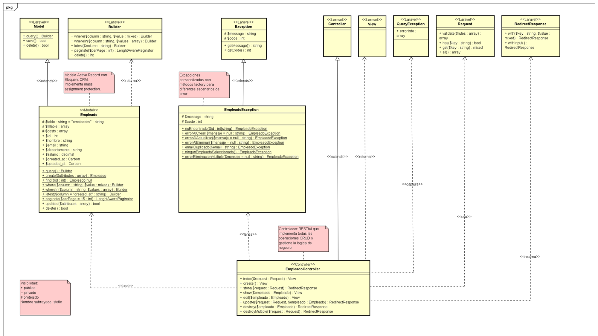
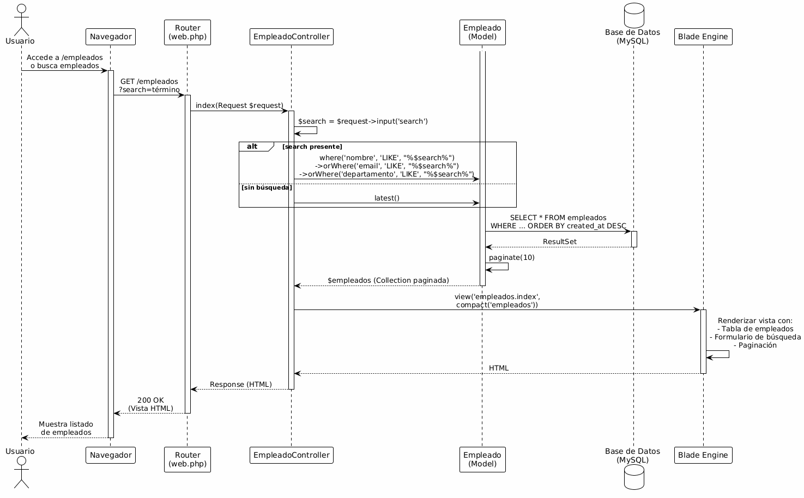
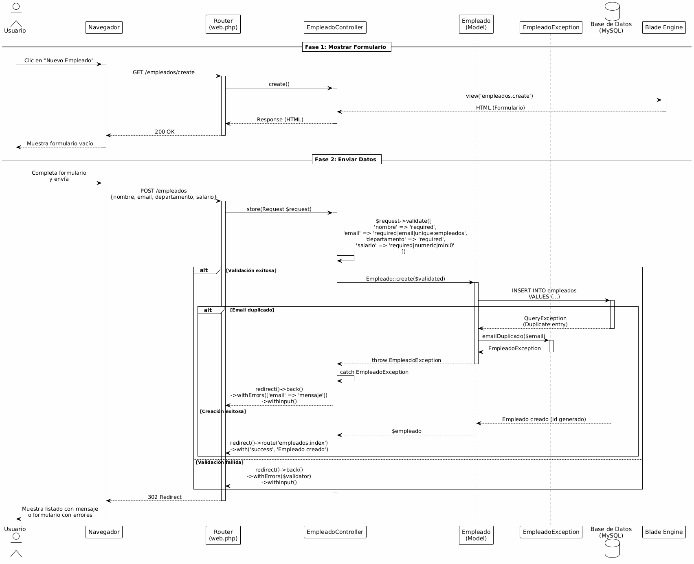
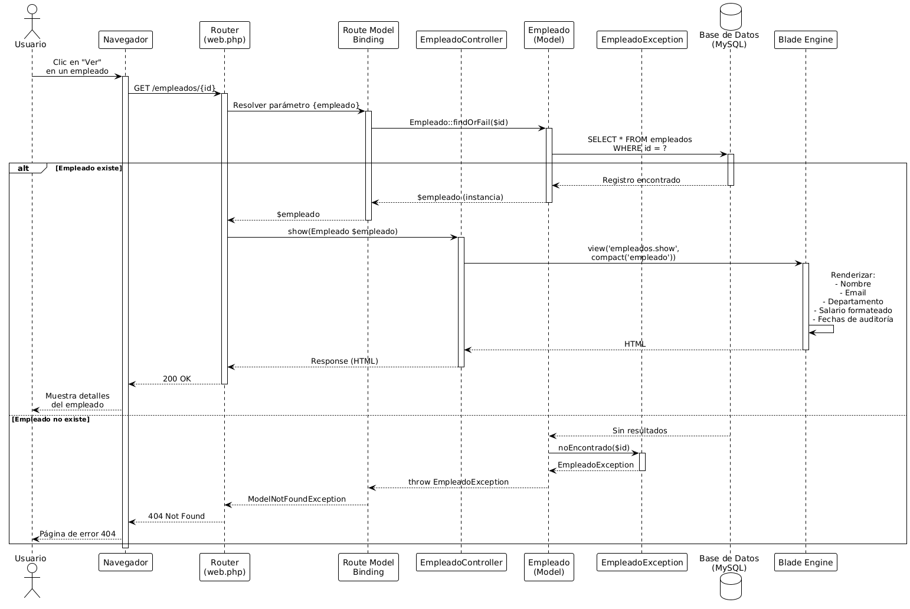
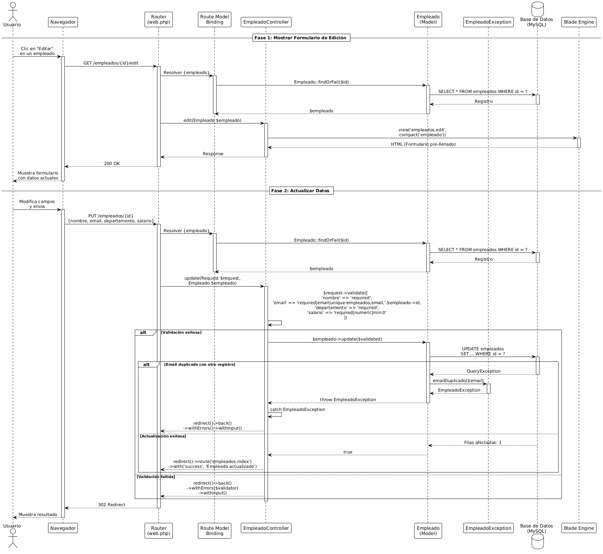
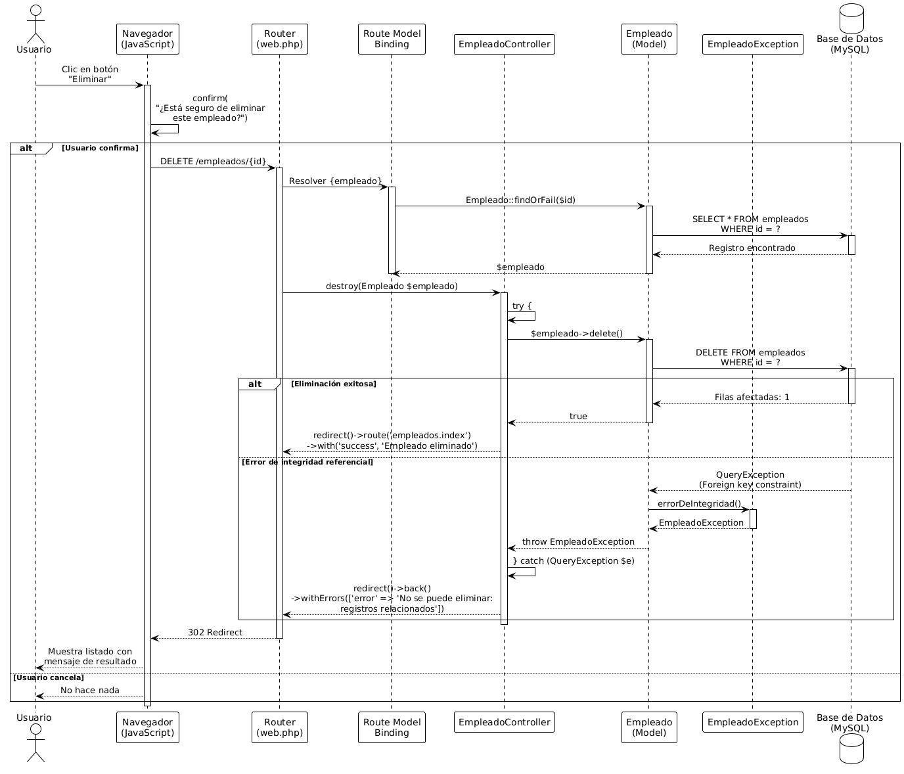
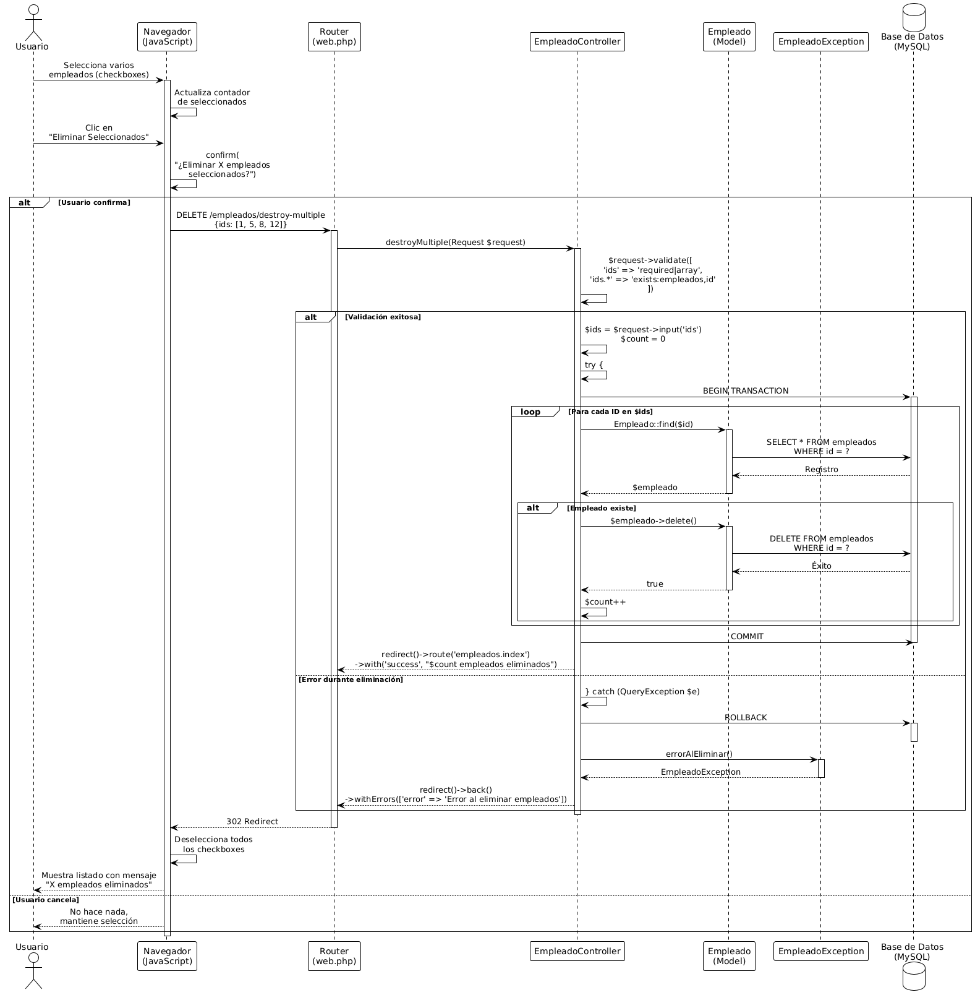

# Documentación del Sistema - CRUD de Empleados

## 1. Descripción de Funcionalidades

### 1.1 Objetivo Principal

El sistema CRUD de Empleados es una aplicación web desarrollada con el framework Laravel que tiene como objetivo principal **gestionar de manera eficiente la información de los empleados de una organización**. La aplicación permite realizar operaciones completas de creación, lectura, actualización y eliminación (CRUD) de registros de empleados, proporcionando una interfaz intuitiva y segura para la administración de datos del personal.

El sistema está diseñado para facilitar el mantenimiento de información básica de empleados, incluyendo datos personales, información de contacto, asignación departamental y datos salariales, con mecanismos robustos de validación y manejo de errores.

### 1.2 Funcionalidades del Módulo

#### 1.2.1 Gestión de Empleados

**1. Listado de Empleados**
   - Visualización de todos los empleados registrados en formato de tabla.
   - Paginación automática de resultados (10 registros por página).
   - Ordenamiento de empleados por fecha de creación (más recientes primero).
   - Diseño responsive que se adapta a diferentes tamaños de pantalla.
   - Información mostrada: ID, Nombre, Email, Departamento, Salario.
   - Acciones disponibles por empleado: Ver, Editar, Eliminar.

**2. Búsqueda de Empleados**
   - Campo de búsqueda en tiempo real.
   - Búsqueda por nombre del empleado.
   - Búsqueda por correo electrónico.
   - Búsqueda por departamento.
   - Botón de limpieza para resetear filtros.
   - Mantenimiento de parámetros de búsqueda durante la paginación.

**3. Creación de Empleados**
   - Formulario intuitivo con validación en el cliente y servidor.
   - Campos requeridos:
     - Nombre completo.
     - Correo electrónico (único en el sistema).
     - Departamento.
     - Salario (formato numérico con decimales).
   - Validación de formato de email.
   - Prevención de emails duplicados.
   - Mensajes de error específicos por campo.
   - Retención de datos ingresados en caso de error.
   - Redirección automática al listado tras creación exitosa.

**4. Visualización de Detalles**
   - Vista detallada de información de un empleado específico.
   - Visualización de todos los campos del empleado.
   - Información de auditoría:
     - Fecha y hora de creación.
     - Fecha y hora de última actualización.
   - Formato de moneda para el salario.
   - Navegación rápida a edición o eliminación.
   - Opción para regresar al listado.

**5. Actualización de Empleados**
   - Formulario de edición pre-llenado con datos actuales.
   - Validación de datos similar a la creación.
   - Validación de email único (excluyendo el registro actual).
   - Actualización de campos:
     - Nombre.
     - Email.
     - Departamento.
     - Salario.
   - Confirmación de cambios guardados.
   - Manejo de errores con retención de datos.

**6. Eliminación de Empleados**
   - Eliminación individual con confirmación.
   - Diálogo de confirmación para prevenir eliminaciones accidentales.
   - Mensaje de éxito tras eliminación.
   - Manejo de errores de integridad referencial.
   - Redirección automática al listado.

**7. Eliminación Múltiple**
   - Selección individual de empleados mediante checkboxes.
   - Checkbox "Seleccionar Todos" en el encabezado.
   - Contador visual de elementos seleccionados.
   - Botón "Eliminar Seleccionados" (habilitado solo con selección activa).
   - Confirmación antes de eliminación masiva.
   - Mensaje informando la cantidad de registros eliminados.
   - Sincronización automática de checkboxes.

#### 1.2.2 Validación y Seguridad

**8. Validación de Datos**
   - Validación de campos requeridos.
   - Validación de formato de email.
   - Validación de unicidad de email.
   - Validación de tipo numérico para salario.
   - Validación de valores positivos para salario.
   - Mensajes de error descriptivos por campo.
   - Validación tanto en cliente como en servidor.

**9. Manejo de Excepciones**
   - Excepciones personalizadas para operaciones de empleados.
   - Captura de errores de duplicación de email.
   - Manejo de errores de base de datos.
   - Manejo de restricciones de integridad referencial.
   - Mensajes de error amigables para el usuario.
   - Registro de errores para debugging.
   - Códigos HTTP apropiados (404, 422, 500).

**10. Protección de Datos**
   - Mass assignment protection en el modelo.
   - Validación de entrada de datos.
   - Sanitización automática de datos.
   - Prevención de inyección SQL mediante Eloquent ORM.
   - Token CSRF en todos los formularios.

#### 1.2.3 Experiencia de Usuario

**11. Interfaz de Usuario**
   - Diseño limpio y profesional con Tailwind CSS.
   - Colores consistentes y agradables a la vista.
   - Iconografía clara para acciones.
   - Feedback visual para acciones del usuario.
   - Estados hover para elementos interactivos.
   - Diseño responsive para dispositivos móviles.
   - Accesibilidad mediante etiquetas semánticas.

**12. Mensajes y Notificaciones**
   - Mensajes de éxito en fondo verde.
   - Mensajes de error en fondo rojo.
   - Notificaciones temporales que no interrumpen el flujo.
   - Mensajes contextuales específicos a cada acción.
   - Información clara sobre el resultado de operaciones.

**13. Navegación**
   - Breadcrumbs implícitos en títulos de página.
   - Botones de navegación claramente identificados.
   - Enlaces de retorno en todas las vistas.
   - URLs amigables y descriptivas.
   - Paginación intuitiva con números de página.

#### 1.2.4 Rendimiento y Optimización

**14. Gestión de Datos**
   - Paginación para optimizar carga de grandes volúmenes.
   - Consultas optimizadas con Eloquent.
   - Índices de base de datos en campos clave.
   - Carga diferida de relaciones cuando sea necesario.
   - Cacheo de consultas frecuentes.

**15. Validación Eficiente**
   - Validación en el servidor para seguridad.
   - Validación HTML5 para feedback inmediato.
   - Mensajes de error sin recargar la página completa.
   - Retención de datos del formulario en errores.

#### 1.2.5 Mantenibilidad

**16. Arquitectura**
   - Patrón MVC (Model-View-Controller).
   - Separación clara de responsabilidades.
   - Código modular y reutilizable.
   - Naming conventions consistentes.
   - Estructura de directorios estándar de Laravel.

**17. Documentación**
   - Comentarios PHPDoc en todas las clases.
   - Documentación de métodos con parámetros y retornos.
   - Descripción de excepciones lanzadas.
   - Documentación de propiedades del modelo.
   - README con instrucciones de instalación.

---

## Resumen de Capacidades

El sistema proporciona una solución completa para la gestión de empleados con:

- 17 funcionalidades principales implementadas.
-  Operaciones CRUD completas.
-  Búsqueda y filtrado avanzado.
- ✅ Selección y eliminación múltiple.
- ✅ Validación robusta de datos.
- ✅ Manejo profesional de errores.
- ✅ Interfaz de usuario moderna y responsive.
- ✅ Arquitectura escalable y mantenible.
- ✅ Seguridad integrada.
- ✅ Documentación completa del código.

El módulo está diseñado para ser intuitivo para usuarios finales mientras mantiene la robustez técnica necesaria para entornos de producción.

---

## 2. Descripción de Componentes

---

## 3. Descripción de Clases

El sistema implementa tres clases principales que encapsulan la lógica de negocio, acceso a datos y manejo de excepciones.

### 3.1 Clase: EmpleadoController

**Nombre de la clase:** EmpleadoController

**Descripción:**
Clase controladora que implementa el patrón MVC, actuando como intermediario entre las vistas y el modelo. Gestiona todas las operaciones HTTP relacionadas con empleados, incluyendo listado, creación, edición, visualización y eliminación (individual y múltiple). Implementa validación de datos, manejo de excepciones y lógica de búsqueda.

**Dependencias con otras clases:**

| Clase Asociada | Tipo de Asociación | Descripción |
|----------------|-------------------|-------------|
| Empleado | Dependencia | Utiliza el modelo para operaciones CRUD en la base de datos |
| EmpleadoException | Dependencia | Lanza excepciones personalizadas para manejo de errores |
| Request | Dependencia | Recibe y procesa datos de solicitudes HTTP |
| QueryException | Dependencia | Captura excepciones de base de datos para manejo específico |

**Atributos:**

No tiene atributos de instancia propios. Hereda atributos de la clase Controller de Laravel.

**Funciones:**

| Función | Argumentos | Tipo de Retorno | Visibilidad | Servicio | Descripción |
|---------|-----------|----------------|-------------|----------|-------------|
| `index()` | `Request $request` | `View` | public | IHTTPHandler::index | Lista empleados con paginación y búsqueda opcional. Filtra por nombre, email o departamento según parámetro 'search' |
| `create()` | Ninguno | `View` | public | IHTTPHandler::create | Retorna vista con formulario de creación vacío |
| `store()` | `Request $request` | `RedirectResponse` | public | IHTTPHandler::store | Valida y crea nuevo empleado. Maneja duplicación de email y errores de BD |
| `show()` | `Empleado $empleado` | `View` | public | IHTTPHandler::show | Muestra detalles completos de un empleado específico usando route model binding |
| `edit()` | `Empleado $empleado` | `View` | public | IHTTPHandler::edit | Retorna vista con formulario pre-llenado para edición |
| `update()` | `Request $request`, `Empleado $empleado` | `RedirectResponse` | public | IHTTPHandler::update | Valida y actualiza empleado existente. Excluye ID actual en validación de email único |
| `destroy()` | `Empleado $empleado` | `RedirectResponse` | public | IHTTPHandler::destroy | Elimina un empleado. Maneja restricciones de integridad referencial |
| `destroyMultiple()` | `Request $request` | `RedirectResponse` | public | IHTTPHandler::destroyMultiple | Elimina múltiples empleados. Valida array de IDs y retorna cantidad eliminada |

---

### 3.2 Clase: Empleado

**Nombre de la clase:** Empleado

**Descripción:**
Clase modelo que representa la entidad Empleado implementando el patrón Active Record mediante Eloquent ORM. Encapsula los datos y comportamiento de un empleado, proporcionando métodos para interactuar con la tabla 'empleados' en la base de datos. Define atributos asignables en masa, conversiones de tipos y relación con la tabla.

**Dependencias con otras clases:**

| Clase Asociada | Tipo de Asociación | Descripción |
|----------------|-------------------|-------------|
| Model | Herencia | Extiende de Eloquent Model para funcionalidad ORM |
| HasFactory | Uso de Trait | Permite generación de instancias de prueba mediante factories |
| Builder | Dependencia | Retorna Query Builder para construcción de consultas complejas |
| Collection | Dependencia | Retorna colecciones de empleados en consultas múltiples |

**Atributos:**

| Nombre | Tipo | Visibilidad | Valor por Omisión | Descripción |
|--------|------|-------------|-------------------|-------------|
| `$table` | string | protected | 'empleados' | Nombre de la tabla en la base de datos |
| `$fillable` | array | protected | ['nombre', 'email', 'departamento', 'salario'] | Atributos permitidos para asignación masiva |
| `$casts` | array | protected | ['salario' => 'decimal:2', 'created_at' => 'datetime', 'updated_at' => 'datetime'] | Conversiones de tipos de atributos |
| `$id` | int | public | Auto-increment | Identificador único del empleado (clave primaria) |
| `$nombre` | string | public | null | Nombre completo del empleado |
| `$email` | string | public | null | Correo electrónico único del empleado |
| `$departamento` | string | public | null | Departamento al que pertenece |
| `$salario` | decimal | public | null | Salario del empleado con 2 decimales |
| `$created_at` | Carbon | public | CURRENT_TIMESTAMP | Fecha y hora de creación del registro |
| `$updated_at` | Carbon | public | CURRENT_TIMESTAMP | Fecha y hora de última actualización |

**Funciones:**

| Función | Argumentos | Tipo de Retorno | Visibilidad | Servicio | Descripción |
|---------|-----------|----------------|-------------|----------|-------------|
| `query()` | Ninguno | `Builder` | public static | IDataAccess::query | Retorna constructor de consultas para operaciones complejas |
| `create()` | `array $attributes` | `Empleado` | public static | IDataAccess::create | Crea y persiste nuevo empleado con atributos proporcionados |
| `update()` | `array $attributes` | `bool` | public | IDataAccess::update | Actualiza atributos del empleado. Retorna true si exitoso |
| `delete()` | Ninguno | `bool` | public | IDataAccess::delete | Elimina el registro del empleado. Retorna true si exitoso |
| `find()` | `int $id` | `Empleado\|null` | public static | IDataAccess::find | Busca empleado por ID. Retorna null si no existe |
| `where()` | `string $column`, `mixed $value` | `Builder` | public static | IDataAccess::where | Filtra empleados por columna y valor |
| `paginate()` | `int $perPage = 15` | `LengthAwarePaginator` | public static | IDataAccess::paginate | Retorna resultados paginados con metadata |
| `latest()` | `string $column = 'created_at'` | `Builder` | public static | IDataAccess::latest | Ordena por columna descendente (más recientes primero) |
| `whereIn()` | `string $column`, `array $values` | `Builder` | public static | IDataAccess::whereIn | Filtra por valores en array (usado en eliminación múltiple) |

---

### 3.3 Clase: EmpleadoException

**Nombre de la clase:** EmpleadoException

**Descripción:**
Clase de excepción personalizada que extiende Exception de PHP. Proporciona métodos factory estáticos para crear excepciones con mensajes descriptivos y códigos HTTP apropiados según el contexto del error. Facilita manejo consistente de errores específicos del dominio de empleados en toda la aplicación.

**Dependencias con otras clases:**

| Clase Asociada | Tipo de Asociación | Descripción |
|----------------|-------------------|-------------|
| Exception | Herencia | Extiende clase base Exception de PHP |
| EmpleadoController | Uso | Es lanzada por el controlador en situaciones de error |

**Atributos:**

| Nombre | Tipo | Visibilidad | Valor por Omisión | Descripción |
|--------|------|-------------|-------------------|-------------|
| `$message` | string | protected | '' | Mensaje descriptivo de la excepción (heredado de Exception) |
| `$code` | int | protected | 0 | Código HTTP de error (heredado de Exception) |

**Funciones:**

| Función | Argumentos | Tipo de Retorno | Visibilidad | Servicio | Descripción |
|---------|-----------|----------------|-------------|----------|-------------|
| `noEncontrado()` | `int\|string $id` | `EmpleadoException` | public static | IExceptionHandler::noEncontrado | Crea excepción con código 404 cuando empleado no existe |
| `errorAlCrear()` | `string\|null $mensaje = null` | `EmpleadoException` | public static | IExceptionHandler::errorAlCrear | Crea excepción con código 500 por fallo en creación |
| `errorAlActualizar()` | `string\|null $mensaje = null` | `EmpleadoException` | public static | IExceptionHandler::errorAlActualizar | Crea excepción con código 500 por fallo en actualización |
| `errorAlEliminar()` | `string\|null $mensaje = null` | `EmpleadoException` | public static | IExceptionHandler::errorAlEliminar | Crea excepción con código 500 por fallo en eliminación |
| `emailDuplicado()` | `string $email` | `EmpleadoException` | public static | IExceptionHandler::emailDuplicado | Crea excepción con código 422 por email ya registrado |
| `ningunEmpleadoSeleccionado()` | Ninguno | `EmpleadoException` | public static | IExceptionHandler::ningunEmpleadoSeleccionado | Crea excepción con código 422 por selección vacía |
| `errorEliminacionMultiple()` | `string\|null $mensaje = null` | `EmpleadoException` | public static | IExceptionHandler::errorEliminacionMultiple | Crea excepción con código 500 por fallo en eliminación múltiple |

---

### 3.4 Diagrama de Clases UML

**Descripción del Diagrama de Clases:**

El diagrama muestra la estructura de clases del sistema con las siguientes características:

**Clases Principales:**

1. **EmpleadoController (Azul):**
   - Controlador que extiende de la clase base Controller de Laravel
   - Contiene 8 métodos públicos para operaciones CRUD
   - Depende de Request, View, RedirectResponse, Empleado y EmpleadoException
   - Gestiona la lógica de negocio y flujo de la aplicación

2. **Empleado (Verde):**
   - Modelo que extiende de Model (Eloquent ORM)
   - Contiene 7 atributos públicos (propiedades del modelo)
   - 3 atributos protegidos para configuración
   - Métodos estáticos para consultas y métodos de instancia para operaciones
   - Retorna Builder para construcción de queries complejas

3. **EmpleadoException (Rosa):**
   - Excepción personalizada que extiende Exception de PHP
   - 7 métodos factory estáticos para diferentes escenarios de error
   - Cada método retorna una instancia configurada con mensaje y código HTTP

**Clases del Framework Laravel (Amarillo):**
- Controller, Model, Exception: Clases base
- Request, View, RedirectResponse: Tipos de retorno HTTP
- Builder: Constructor de consultas
- QueryException: Excepciones de base de datos

**Relaciones:**
- **Herencia (línea sólida con triángulo):** EmpleadoController → Controller, Empleado → Model, EmpleadoException → Exception
- **Dependencia (línea punteada):** Indica uso de clases sin mantener referencia
- **Asociación (línea sólida con flecha):** EmpleadoController gestiona Empleado y lanza EmpleadoException

**Visibilidad:**
- `+` público
- `#` protegido
- `-` privado
- `Nombre subrayado` static

---

## 4. Descripciones de secuencias

Los diagramas de secuencia ilustran la interacción entre los diferentes componentes del sistema durante la ejecución de casos de uso específicos. A continuación se presentan los diagramas de secuencia para las operaciones principales del sistema CRUD de Empleados.

### 4.1 Secuencia: Listar y buscar Empleados

**Nombre:** Listado y Búsqueda de Empleados.

**Descripción:** 
Esta secuencia muestra el flujo de interacción cuando un usuario accede al listado de empleados o realiza una búsqueda. El proceso comienza con una petición HTTP GET al servidor, el controlador obtiene los empleados de la base de datos (opcionalmente filtrando por término de búsqueda), y retorna una vista HTML con los resultados paginados. Si existe un término de búsqueda, se aplican filtros sobre los campos nombre, email y departamento.

**Diagrama UML:**

---

### 4.2 Secuencia: Crear Empleado

**Nombre:** Creación de un Nuevo Empleado.

**Descripción:**
Este diagrama ilustra el proceso completo de creación de un empleado. Consta de dos fases: primero, el usuario solicita el formulario de creación (GET), y segundo, envía los datos del nuevo empleado (POST). Durante la fase POST, el sistema valida los datos, verifica que el email no esté duplicado, crea el registro en la base de datos y redirige al usuario al listado con un mensaje de confirmación. Si ocurre un error (validación fallida o email duplicado), se captura la excepción y se retorna al formulario con mensajes de error.

**Diagrama UML:**

---

### 4.3 Secuencia: Visualizar Detalles de Empleado

**Nombre:** Mostrar Información Detallada de un Empleado.

**Descripción:**
Esta secuencia describe el flujo cuando un usuario desea ver los detalles completos de un empleado específico. El usuario hace clic en "Ver" desde el listado, lo que genera una petición GET con el ID del empleado. Laravel utiliza Route Model Binding para cargar automáticamente el modelo desde la base de datos. Si el empleado existe, se muestra una vista detallada con toda la información incluyendo fechas de auditoría. Si el empleado no existe, se lanza una excepción EmpleadoNoEncontrado que retorna un error 404.

**Diagrama UML:**

---

### 4.4 Secuencia: Editar Empleado

**Nombre:** Actualización de Información de Empleado.

**Descripción:**
Este diagrama muestra el proceso de actualización de un empleado existente. Similar a la creación, tiene dos fases: GET para mostrar el formulario pre-llenado con los datos actuales, y PUT para procesar la actualización. Durante la actualización, el sistema valida los datos, verifica que el email no esté duplicado (excluyendo el registro actual), actualiza el registro en la base de datos y redirige al usuario. El manejo de excepciones cubre errores de validación, emails duplicados y problemas de base de datos.

**Diagrama UML:**

---

### 4.5 Secuencia: Eliminar Empleado Individual

**Nombre:** Eliminación de un Empleado.

**Descripción:**
Esta secuencia representa el proceso de eliminación de un empleado individual. El usuario hace clic en el botón "Eliminar" y confirma la acción en un diálogo JavaScript. Se envía una petición DELETE al servidor con el ID del empleado. El controlador carga el modelo (mediante Route Model Binding), ejecuta la eliminación en la base de datos y redirige al listado con un mensaje de éxito. Si ocurre un error durante la eliminación (como violaciones de integridad referencial), se captura y se muestra un mensaje de error apropiado.

**Diagrama UML:**

---

### 4.6 Secuencia: Eliminación Múltiple de Empleados

**Nombre:** Eliminación en Lote de Empleados.

**Descripción:**
Este diagrama ilustra el proceso de eliminación múltiple de empleados. El usuario selecciona varios empleados mediante checkboxes en el listado, hace clic en "Eliminar Seleccionados" y confirma la acción. Se envía una petición DELETE con un array de IDs seleccionados. El controlador itera sobre cada ID, elimina los registros de la base de datos en una transacción, y retorna al listado con un mensaje indicando cuántos empleados fueron eliminados exitosamente. El proceso está protegido con manejo de excepciones para garantizar consistencia de datos.

**Diagrama UML:**

---
